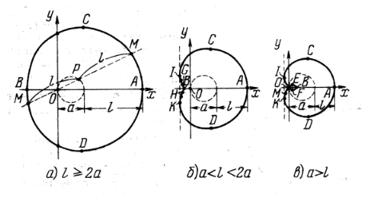

# Лабораторные работы МиАКГ

## Содержание:

1. **[Лабораторная 1](#лабораторная-1)**

## Лабораторная 1

 ****_Используя стандартные средства вывода графической информации SDL,построить график кривой "Улитка паскаля"._****

